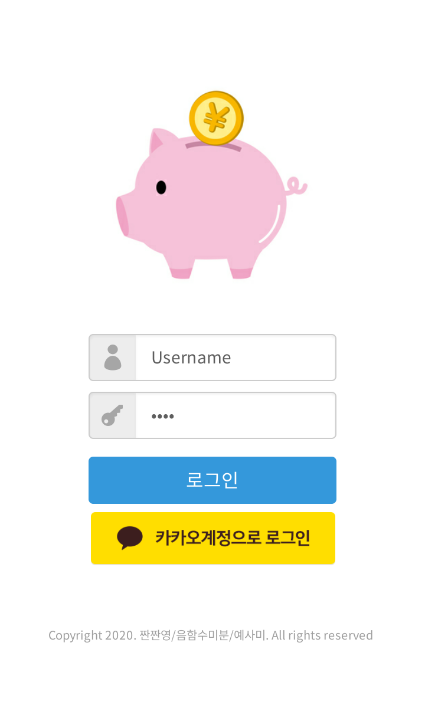
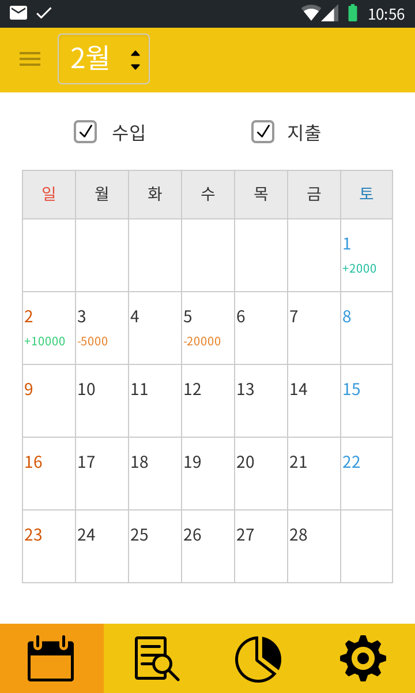
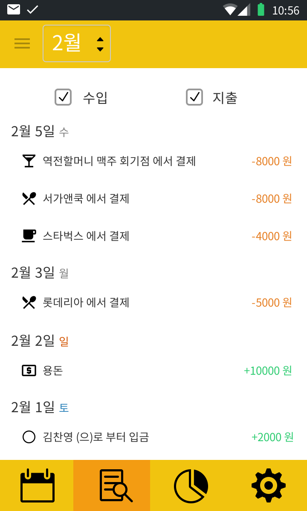
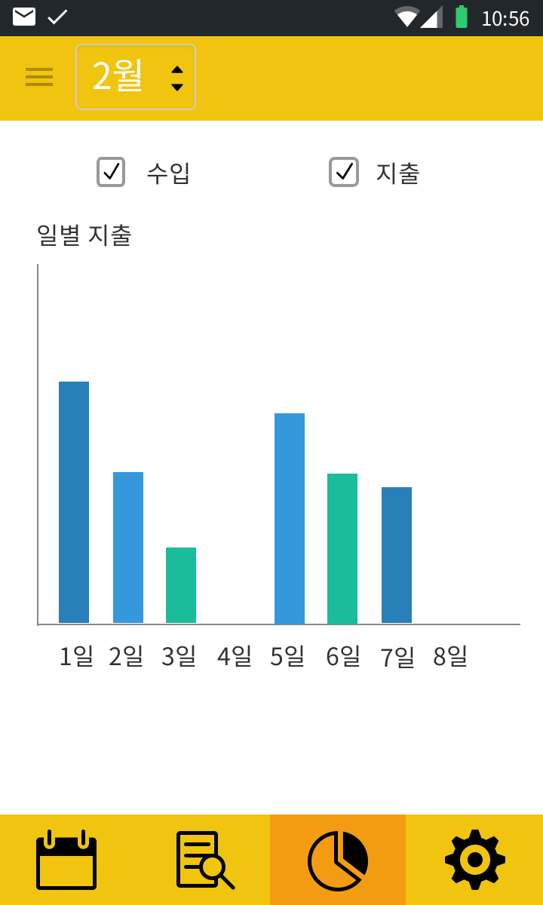
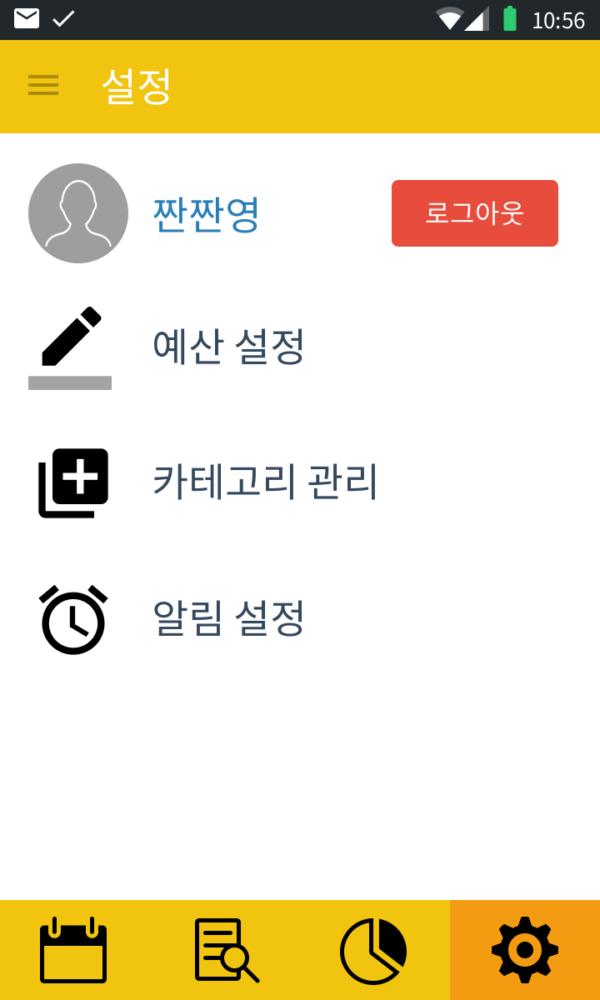

# ToyProject :seedling:

###### Copyright 2020. 짠짠영/음함수미분/예사미. All rights reserved.

## 0.링크
#### <a href="https://bit.ly/2vbsujA" target="_blank">[링크] 간트차트</a> 
#### <a href="http://ssak.jandi.com" target="_blank">[링크] 잔디 협업 페이지</a>

## 1.주제
#### 가계부 :poop:

## 2.목적
#### 가계부 웹 / 앱 을 여러 신기술을 이용해 제작해 봄으로 새로운 지식을 습득하고 포트폴리오 작성에 도움이 됨.

## 3.기능 
#### 1) 일반 로그인 , 카카오 로그인
#### 2) 문자메시지 연동을 통한 지출 내역 입력
#### 3) 사용자 직접 입력을 통한 지출 내역 입력
#### 4) 지출 / 수입 내역을 카테고리 별 분류
#### 5) 분류한 내용을 기반으로 월별 통계 출력 및 분석
#### 6) 분석을 통한 지출 조언 및 지정한 지출금액 초과 시 알람
#### 7) 지문 인식 로그인 :question:
#### 8) 미정 :poop:

## 4. 사용자 플로우 :recycle:
#### 1) 첫 실행 시 카카오 로그인 혹은 회원가입을 통해 로그인
#### 2) 1번 탭인 메인 화면으로 월별 달력 노출. 각 날짜에 수입 및 지출 내역
#### 3) 월 별 달력에서 날짜 선택 시 팝업창으로 수입 및 지출 수동 입력
#### 4) 2번 탭. 각 일자별 세부내역 조회
#### 5) 3번 탭. 사용처 별 통계 그래프 확인
#### 6) 설정 탭. 로그아웃 , 예산 설정 , 카테고리 관리 , 알림 차단 기능 등

## 5. API 정보
#### 1) 로그인 /Login 으로 반환값 응답코드 , 이메일 , 이름 , 핸드폰 번호
#### 2) 

## 6. 프로토타입
 
 
 

## 7. 마크업

